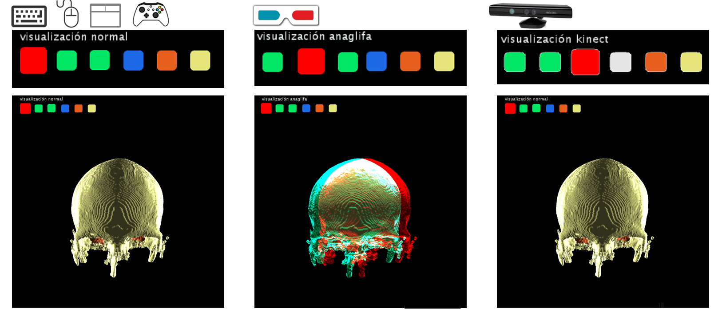
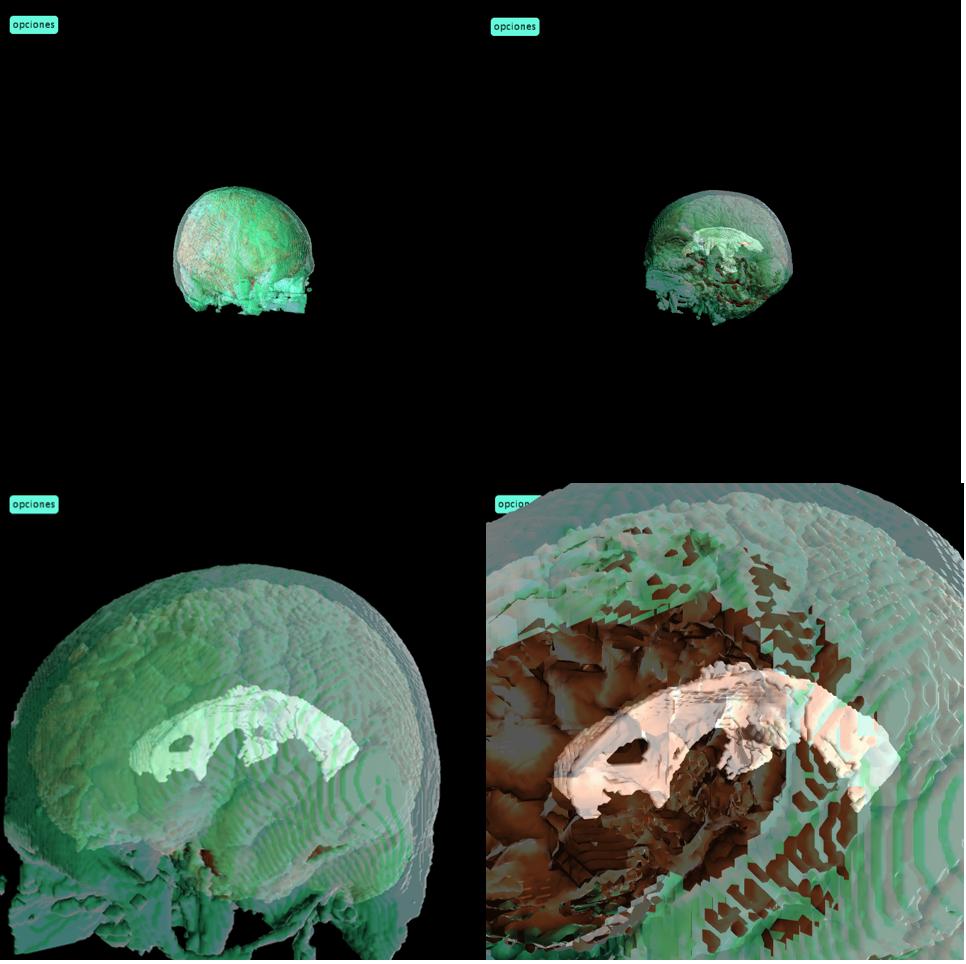
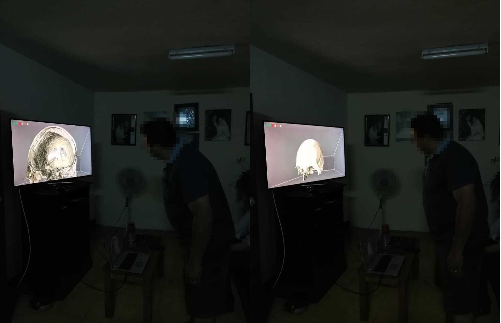

## Visualizador de imágenes volumétricas

En este proyecto, es posible visualizar imágenes volumetricas de manera interactiva, y poder controlar parametros tales como:
* orientación
* posición
* color
* transparencia

